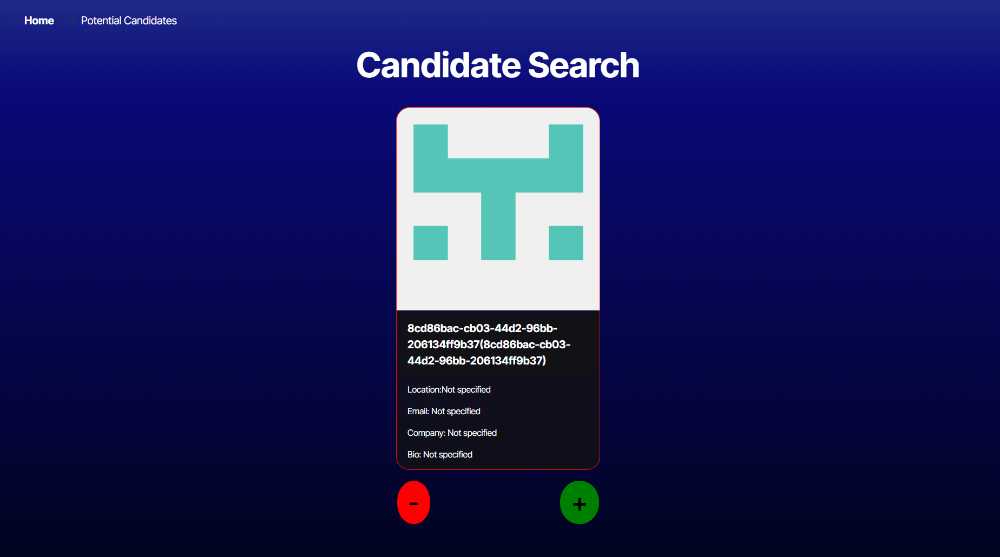
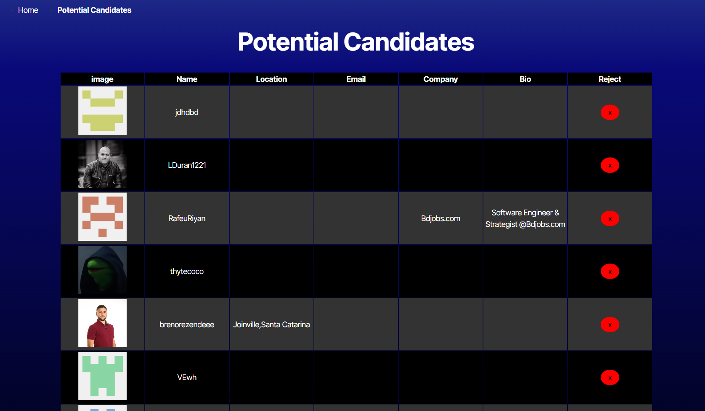
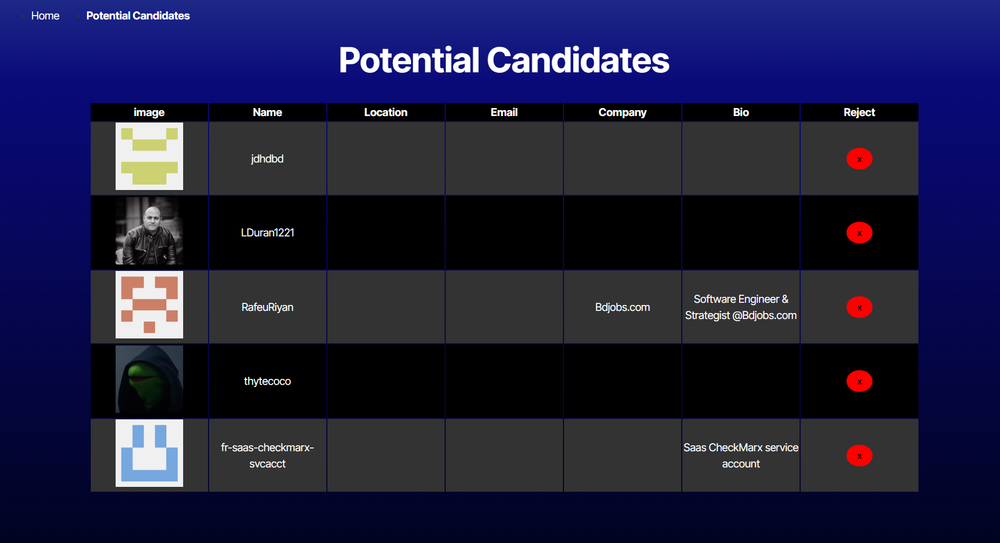

# Git_Cand_finder
Git Candidate Finder

## Basic Overview
This website servers as a completion of a candidate search application that calls the GitHub API and renders data in the browser. The application’s API, retrieves data from the GitHub API, that has already been created. The entire application was then deployed to Render.

## The Application

The application was deployed on Netlify.com to host the website. The website was created using the following tools: 

    React
    type: TypeScript
    Deployment: Render

The website  has two (2) pages:

    Home: Random Candidate search

    Potental Candidates: hosts the saved candidates

## Deployment

The application was deployed to Render.com.

[Link here](https://git-cand-finder.onrender.com)

    
## Screenshot
The following images demonstrates the application's appearance:

Home Page

Potential Candidates Page

No Saved Candidates

Saved Candidates

Removed Candidates

© 2024 lenworth425 Confidential and Proprietary. All Rights Reserved.